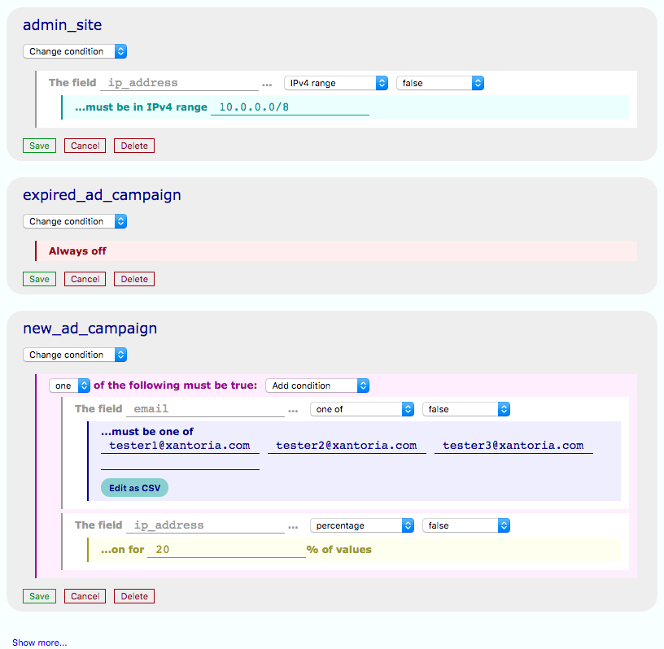

# Flippy

Easy feature switching with arbitrary switches and conditions. Runs as a standalone
application ([giftig/flippy-standalone](https://www.github.com/giftig/flippy-standalone)) with
an HTTP JSON API, and can also be used locally as a library for scala applications.



## What is feature-switching?

Feature switching, also known as feature toggle, feature flipping, or feature flags, is a technique
used to deliver new features to users in a controlled, safe, and testable way. It is used to allow
safe continuous delivery of software via techniques such as:

* **Canary releasing**, initially releasing features to a small proportion of your userbase before
rolling out

to conduct A-B testing,gauging reaction to new features, and


## Quickstart

A ```docker-compose.yaml``` is provided to make it easy to quickly spin up flippy with a redis
backend and an admin site. All you need is docker and docker-compose. To get a working environment
with the latest stable release, use:

    docker-compose up -d

This will expose the flippy API on port 9001 by default, and you can access the admin interface
at http://localhost:9002.

### Change versions

A ```.env``` is also provided to ```docker-compose``` providing default versions and ports; you can
easily export any variable in that file to change the versions or ports you want to run on.

    export FLIPPY_VERSION=edge
    export FLIPPY_ADMIN_VERSION=edge
    export FLIPPY_ADMIN_PORT=80
    docker-compose up -d

## Switch conditions

Many default conditions are provided, and can be assembled to form a "master condition"
which represents all the conditions which go into determining if a switch is on or off based on
a set of data. The admin site makes it very easy to construct these conditions, which are encoded
as JSON and defined by classes extending `Condition`.

For more information, see [the conditions overview](readme-resources/conditions.md)


### Scala DSL
There is also a small scala DSL provided in the flippy library in case you use the "mirror"
backend as a scala client for flippy, or use flippy as a library within your application. It's
also useful for testing.

    // Only users whose names are between these fine gentlemen shall have the switch on
    val condition = StringConditions.Range("Albert", "George") on "name"

    backend.configureSwitch("is_gentleman", condition)
    backend.isActive("is_gentleman", Map("name" -> "Charlie Charlington"))  // on
    backend.isActive("is_gentleman", Map("name" -> "Kevin Louterson")  // off

You can also define your own switch condition by extending `Condition`:

    case object AllLuckySevens extends Condition {
      def appliesTo(a: Any) = a == 7777
    }

    val condition = AllLuckySevens on "HP" && Condition.Equals("Cloud") on "name"
    backend.configureSwitch("lotsofdamage", condition)
    backend.isActive("lotsofdamage", Map("name" -> "Cloud", "HP" -> 7777))  // on


## Backends
### Redis
Store keys in redis using a configurable prefix. When listing keys, this uses SCAN to fetch them,
but it has to obtain all of them as redis isn't capable of iterating over keys in a defined
order. With large numbers of keys, frequent calls to the list endpoint should be avoided, or else
the results cached (a ```CachedRedisBackend``` is on the roadmap).


### In-memory

This is designed for testing only and is not recommended for production.

### Future support

Support is currently also planned for CouchDB, Postgres, and MySQL


## Serialization

Conditions are serialized into JSON, allowing them to be stored and passed over APIs effectively.
Each condition has a core ```condition_type``` which allows the condition class and serializer to
be identified, and otherwise their properties vary based on which type of condition is present.

The structure can be nested as needed to provide complex, compound conditions. For example,
consider the JSON representation of a switch matching users who are staff members or who originate
from local host:

    {
      "condition_type": "or",
      "conditions": [
        {
          "condition_type": "namespaced",
          "attr": "ip_address",
          "fallback": false,
          "condition": {
            "condition_type": "equals",
            "value": "127.0.0.1"
          }
        },
        {
          "condition_type": "namespaced",
          "attr": "is_staff",
          "fallback": false,
          "condition": {
            "condition_type": "equals",
            "value": true
          }
        }
      ]
    }

The serialization of these conditions are delegated to subclasses of ```ConditionSerializer```,
which must define ```serialize```, ```deserialize```, and ```canSerialize``` methods to allow
the main serializer to identify the correct serializer based on ```condition_type``` and pass
serialization on to that instance. The so-called ```SerializationEngine``` is provided with a
List of appropriate ```ConditionSerializer``` subclasses in order to effect the correct
behaviour; this engine defines liftweb serialization formats, so it is intended to be used to
provide implicit formats for liftweb operations.

The default set of serializers provided for the ```SerializationEngine``` allows working with
all the default Condition types, but if you need to create your own to accompany a custom
Condition, you can roll your own serialization format, using the existing serializers as a
guide, and add them to your ```SerializationEngine```'s context by instantiating it with a
List including your own serializers. ```SerializationEngine.DEFAULTS``` is provided to easily
concatenate with your own and roll your own set of formats.

## API

The included API is a spray HTTP/JSON API. Conditions are serialized into JSON as described
above. The following endpoints are provided:

### Management

Managing individual switches is done via a RESTful endpoint at ```/switch/<switchname>```.

* POSTing a condition as JSON (see serialization) will create or update the named switch
* GETting a switch will return the configured condition, as JSON, or else 404 if it doesn't exist
* DELETEing a switch will wipe it

You can list existing switches in a paginated way by just hitting ```/switch/``` with a GET request,
optionally providing an offset. At the time of writing, this will always return a max of 10 switches.

### Check switch state

To check the state of a switch, you need to POST context which will let flippy decide if the switch
is on or off, according to the established config. Flippy is agnostic about what is present in that
context; it simply uses it in conjunction with the configured condition to determine switch state.
Simple data types are deserialized for you by built-in context handlers, and can be extended with
more complex serialization logic if, for example, you want to treat a particular object structure
as a more complex entity.

* The state of a single switch can be checked by POSTing context
  to ```/switch/<switchname>/is_active```.

* A list of all active switches for your context can be retrieved by POSTing that context
  to ```/switches/active/```.

## Management interface

Flippy is equipped with an HTTP management interface, in /static. The
recommended approach for serving this interface, and the approach used by the associated
flippy-tester project, is to use nginx or another web server to serve the static files,
proxying requests to flippy itself on a path of your choice. You can retrieve the
giftig/flippy-admin image from dockerhub to easily serve this interface; it is set up with
simple nginx config to serve the static files and proxy to flippy in another container, so
the two can be easily composed.

### Usage
The admin is equipped with widgets for each of the built-in condition types to make it easy and
intuitive to assemble complex conditions from individual building blocks. Each widget describes in
simple English what sort of condition will be applied. In addition, you can edit the raw JSON
yourself by selecting that option in the drop downs when selecting conditions. The main advantage
of this is you can copy the raw JSON for full switch conditions or their components and paste them
into other switches so that components can be easily reused, or you can simply copy the full config
and save it somewhere to be restored later, letting you take a switch offline without having to
manually recreate it later.

The interface is intended to be intuitive as long as the meaning of the conditions are understood,
so for more information on how conditions are built, see
[the conditions overview](readme-resources/conditions.md). As in all areas, suggestions on improving
the usability of this interface are welcome; feel free to raise an issue on github.

## Contributing
### Running tests
#### Docker
To run tests involving docker, you'll need to make sure docker is installed and that you've
set the ```DOCKER_URL``` env var.

    # By default on linux
    export DOCKER_URL=unix:///var/run/docker.sock

### Building the service
To build the service, you'll firstly need to build your changes to the core library here with
`mvn package`, and then rebuild the standalone-service package at
[giftig/flippy-standalone](https://www.github.com/giftig/flippy-standalone/) which will pull
this project as a dependency. You can then simply build your own copy of the docker image using
the Dockerfile in that project.

[TODO] I will be moving the standalone version of this service into this repository shortly and
setting it up as a maven submodule to ensure everything lives in one place and is easier to work
with.

### Building the admin
You can build the admin docker image like this:

    docker build -f Dockerfile-admin -t <tag> .

If you want quick turnaround time for testing admin changes, you can also work on the admin
directly without having to rebuild the image by simply mounting your changes into the image
via docker-compose. Just add the following line to the ```volumes``` section of ```admin```:

    - ./static/:/usr/share/nginx/html:ro

### Development setup
Once you've built your own images for flippy-standalone and the admin, you can simply use the
"Quickstart" guide above and set your versions using environment variables.

You can also run the application natively and serve the admin site however you like, but the
docker solution is pre-spun for you.
